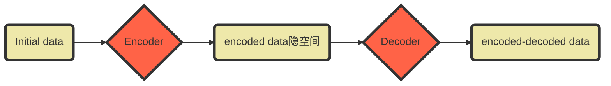
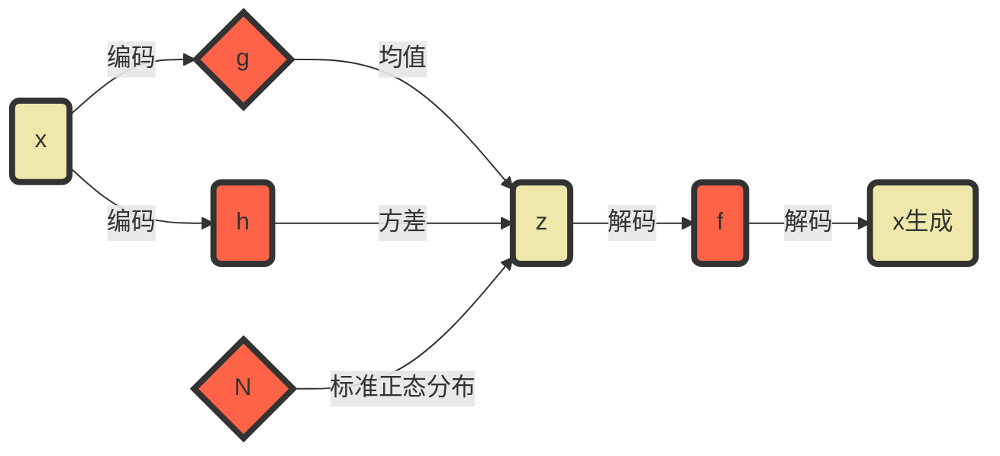

# VAE

VAE（变分自编码器， Variational Autoencoders），生成式模型

看明白VAE需要了解降维的概念，以PCA作为例子，并展示VAE与PCA之间的关系。

## 降维

### **什么是降维？**

> 在机器学习中，**降维是减少描述数据的特征数量的过程**。可以通过**选择**（仅保留一些现有特征）或通过**提取**（基于旧特征组合来生成数量更少的新特征）来进行降维。降维在许多需要低维数据的场景中很有用。尽管有许多不同的降维方法，但是我们可以构建一个适用于大多数方法的总体框架。

首先，我们称**编码器（Encoder）**为从“旧特征”表示中产生“新特征”表示（通过选择或提取）的过程，然后将其逆过程称为**解码（Decoder）**。降维可以被理解为数据压缩，其中编码器压缩数据（从初始空间到**编码空间**，也称为**隐空间**，latent sapce），而解码器则用于解压缩。当然，根据初始数据分布、隐空间大小和编码器的选择，压缩可能是有损的，即**一部分信息会在编码过程中丢失，并且在解码时无法恢复**，产生的损失为**重构误差**。

优化目标：
$$
(e, d)=argmin(\epsilon(x, d(e(x))))
$$
其中x为输入数据，d(e(x))为降维数据，(e, d)为重构误差

## **PCA**

PCA是构建n~e~个新的**独立**特征，这些特征是n~d~个**旧特征的线性组合**，并使得这些新特征所定义的子空间上的数据投影尽可能接近初始数据（就欧几里得距离而言）。换句话说，PCA寻找初始空间的最佳线性子空间（由新特征的正交基定义），以使投影到该子空间上的近似数据的误差尽可能小。

SVD求解（略）

## **自编码器**

**自编码器**总体思路非常简单，主要包括用**神经网络来作为编码器和解码器**，并使用迭代优化学习最佳的**编码-解码方案**。因此，在每次迭代中，我们向自编码器结构（编码器后跟解码器）提供一些数据，我们将编码再解码后的输出与初始数据进行比较，并通过**反向传播误差**来更新网络的权重。

因此，直观地讲，整个自编码器结构（编码器+解码器）会构造出**数据瓶颈（bottleneck）**，从而确保只有信息的主要部分可以通过瓶颈并进行重构。

从我们的总体框架来看，考虑的**编码器E**由编码器网络结构定义，**解码器族D**由解码器网络结构定义，而**重构误差**的减小则通过对编码器和解码器参数进行梯度下降来进行。
$$
loss = ||x-d(e(x))||^2
$$
让我们**首先假设编码器和解码器网络结构都只有一层且没有非线性**（即考虑的是线性自编码器）。

这样的编码器和解码器是简单的线性变换，可以用矩阵表示。

在这种情况下，某种意义上，我们可以看到与PCA的明显的关联，就像PCA中一样，我们正在寻找**最佳的线性子空间**来投影数据，并且使信息损失尽可能少。

用PCA获得的编码和解码矩阵自然地也是梯度下降所能得到的一种解决方案，但是我们应该指出，这不是唯一的解决方案。实际上，**可以选择几组不同的基向量来描述相同的最佳子空间**，因此，几个不同的编码器/解码器对都可以提供最小的重构误差。此外，与PCA不同，对于线性自编码器，我们最终获得的新特征不必是独立的（**神经网络中没有正交性约束，VAE得出的基也不必是正交的**）

现在，让我们进一步假设编码器和解码器都是**深度非线性网络**的。在这种情况下，网络结构越复杂，自编码器就可以进行更多的降维，同时保持较低的重构损失。

但是我们应该牢记两点。首先，在没有重建损失的情况下进行重要的降维通常会带来一个代价：隐空间中缺乏可解释和可利用的结构（**缺乏规则性，lack of regularity**）。其次，大多数时候，降维的最终目的不仅是减少数据的维数，而是要在减少维数的同时将数据主要的结构信息保留在简化的表示中。出于这两个原因，必须根据降维的最终目的来仔细控制和调整隐空间的大小和自编码器的“深度”（深度定义压缩的程度和质量）。

## 变分自编码器（VAE）

**自编码器用于内容生成的局限性**

此时，自然会想到一个问题：“自编码器和内容生成之间的联系是什么？”。确实，一旦对自编码器进行了训练，我们既有编码器又有解码器，但是仍然没有办法来产生任何新内容。乍一看，我们可能会认为，如果隐空间足够规则（在训练过程中被编码器很好地“组织”了），我们可以从该隐空间中随机取一个点并将其解码以获得新的内容，就像生成对抗网络中的生成器一样。但是！自编码器的隐空间的规则性是一个难点，它取决于初始空间中数据的分布、隐空间的大小和编码器的结构。因此，很难先验地确保编码器以与我们刚刚描述的生成过程兼容的方式智能地组织隐空间。

**自编码器仅以尽可能少的损失为目标进行训练，而不管隐空间如何组织**。因此，如果我们对架构的定义不小心，那么在训练过程中，网络很自然地会利用任何过拟合的可能性来尽可能地完成其任务……除非我们明确对其进行规范化！

> 潜在空间值形成不规则的、无界的分布，会使随机点采样变得困难。
>
> 不同图像类别的潜在表示可能在大小上有所不同，导致模型生成某些类别的频率比其他类别高得多。
>
> 传统的自编码器学习的潜在空间不是连续的。
>
> 
>
> 使用传统自编码器作为生成模型存在三个问题:不知道如何从一个不规则的、无界的空间中采样，一些类可能在潜空间中被过度表示，学习空间是不连续的，这使得很难找到一个点将解码成一个良好的图像。所以这时候变分自编码器出现了。

**变分自编码器的定义**

隐空间足够规则。获得这种规律性的一种可能方案是在训练过程中引入显式的**正规化（regularisation）**。

因此，变分自编码器可以定义为一种自编码器，其训练经过**正规化以避免过度拟合**，并确保隐空间具有能够进行数据生成过程的良好属性。

**不是将输入编码为隐空间中的单个点，而是将其编码为隐空间中的概率分布（连续性与规则性）**

> - 首先，将输入编码为在隐空间上的分布；
> - 第二，从该分布中采样隐空间中的一个点；
> - 第三，对采样点进行解码并计算出重建误差；
> - 最后，重建误差通过网络反向传播。

**变分自编码器把原始数据编码为隐空间中的分布，在解码时是从该分布中采样一个点来进行解码**

实践中，选择正态分布作为编码的分布，使得我们可以训练编码器来返回描述高斯分布的均值和协方差矩阵。将输入编码为具有一定方差而不是单个点的分布的原因是这样可以非常自然地表达隐空间规则化：**编码器返回的分布被强制接近标准正态分布**。

此时的Loss为
$$
loss = ||x-d(e(x))||^2 + KL(N(\mu, \sigma), N(0,1))
$$
KL散度又称为相对熵,两个概率分布P和Q差别的非对称性的度量。 KL散度是用来度量使用基于Q的分布来编码服从P的分布的样本所需的额外的平均比特数。典型情况下，P表示数据的真实分布，Q表示数据的理论分布、估计的模型分布、或P的近似分布，其定义为
$$
KL(p(x), q(x)) = \sum{p(x)log\frac{p(x)}{q(x)}}
$$
**关于正则化的直观解释**

我们期望隐空间具有规则性，这可以通过两个主要属性表示：**连续性**（continuity，隐空间中的两个相邻点解码后不应呈现两个完全不同的内容）和**完整性**（completeness，针对给定的分布，从隐空间采样的点在解码后应提供“有意义”的内容）。

VAE将输入编码为**分布**而不是点不足以确保连续性和完整性。如果没有明确定义的正则化项，则模型可以学习最小化其重构误差，从而“忽略”要返回一个分布，最终表现得几乎像普通自编码器一样（导致过度拟合）。具体地说，编码器可以返回具有微小方差的分布（往往是点分布，punctual distributions），或者返回具有巨大均值差异的分布（数据在隐空间中彼此相距很远）。在这两种情况下，返回分布的限制都没有取得效果，并且不满足连续性和/或完整性。

## VAE 数学细节

x为数据变量，z为潜变量，由encoder生成，则有
$$
(1) 从先验分布p(x)采样隐空间z；
(2) 由条件概率p(x|z)采样x
$$
在这种概率模型下，我们可以重新定义编码器和解码器的概念。实际上，与考虑使用确定性编码器和解码器的简单自编码器不同，我们现在将考虑这两个对象的概率版本。
$$
概率解码器:p(x|z) 描述由给定已经编码的变量到解码变量的分布 (由z到x) 由潜变量空间到原始数据空间（解码）的映射
$$

$$
概率编码器:p(z|x) 描述由给定数据变量（原始）到编码变量的分布 (由x到z) 由原始数据空间到潜变量空间的映射
$$

在简单的自编码器中所缺乏的对隐空间的正则化自然出现在数据生成过程的定义中（贝叶斯）：我们假设隐空间中的编码表示z，遵循先验分布p(z)。由**贝叶斯推理问题**：
$$
p(z|x)=\frac{p(x|z)p(z)}{q(x)}=\frac{p(x|z)p(z)}{\int{p(x|u)p(u)du}}
$$
其中p(z)标准高斯分布；p(x|z)高斯分布，均值由变量z的确定性函数f定义(f属于记为F的函数族)，协方差矩阵形式为正常数c*I，I为单位矩阵

则有：
$$
p(z)\sim N(0,I);\\
p(x|z)\sim N(f(z),cI)
$$
而对于高维度的”证据“（归一化因子），常规计算方法比较困难，因此采用**变分推理**的方法进行近似计算。~~直接由贝叶斯难以计算，就换个方法~~。

**变分推理公式**

变分推论（VI）是一种近似复杂分布的技术。这个想法是要设置一个参数化的分布族（例如高斯族，其参数是均值和协方差），并在该族中寻找目标分布的最佳近似。该族中最好的对象是使给定的近似误差测量值最小化的元素（大多数情况下是近似分布与目标分布之间的**Kullback-Leibler散度**），并通过对该族的参数进行梯度下降来发现。

此处，通过高斯分布q~x~(z)近似p(z|x)，其均值与方差由g与h定义，分别属于函数族G与H。
$$
q_x(z)\sim N(g(x), h(x))
$$
现在则需要通过优化g与h最小化q~x~(z)与p(z|x)之间的KL散度，从而找到该族中的最佳近似。
$$
\begin{aligned}
(g^*, h^*)&=argmin~KL(q_x(z),p(z|x))\\
&=argmax~(E_{z~qx}(log(p(x|z))-KL(q_x(z),p(z))))\\
&= argmax~E_{z~qx}(-\frac{|x-f(z)^2|}{2c}-KL(q_x(z),p(z)))
\end{aligned}
$$
等价过程略

等价过程倒数第二个方程中，存在一个权衡点——最大化“观测”的可能性（第一项，【重构出的样本的】预期对数似然概率的最大）与接近先验分布（第二项q~x~(z)与p(z)之间KL散度最小）。

由上(**p(x|z)高斯分布，均值由变量z的确定性函数f定义(f属于记为F的函数族)，协方差矩阵形式为正常数c*I**)，当由确定f时，可以近似p(z|x)。

> 感觉变分推理的意义在于绕过贝叶斯，使用近似的方法求解p(z|x)。q~x~(z)已知。

但是实际上，定义解码器的函数f是未知的，而且也需要求解。但我们最初的目标是找到一种性能良好的编码/解码方案，其隐空间又足够规则，可以用于生成目的。如果规则性主要由在隐空间上假定的先验分布所决定，则整个编码-解码方案的性能高度取决于函数f的选择。

**p(z|x)可以从p(z)与p(x|z)近似（上述数学推理），而p(z)为简单的标准高斯模型，优化c（协方差）与f（分布均值）**，

则对于属于F函数族的任一函数f（定义一个解码器p(x|z))，都可以得到编码器p(x|z)的最佳近似q~x~^*^(z)。无论他的特性如何，但我们正在寻找一种尽可能高效的编码-解码方案，然后，当给定从q~x~^*^(z)采样的z时，希望选择函数f使得x的期望对数似然最大（**变分推理的权衡**）
$$
(f^*,g^*,h^*) = argmax~E_{z~qx}(-\frac{|x-f(z)^2|}{2c}-KL(q_x(z),p(z)))
$$
目标函数中可得到直观描述的元素：x与f(z)之间的重构误差 以及q~x~(z)与p(z)之间的KL散度的正则项，常数c则决定了前两个条件之间的平衡越高，我们对模型中的概率解码器假设p(x|z)周围的方差就越大，我们也就越关注正则化项。

**神经网络引入模型**

目前为止，我们已经建立了一个依赖于三个函数f,g,h的概率模型，并使用变分推理表示要解决的优化问题，以便获得能够给出最优值的f^*^,g^*^,h^*^

由于我们无法轻松地在函数的整个空间上进行优化，因此我们限制了优化域，并决定将f,g,h用神经网络来定义。

**编码器（p(z|x)）**

因此F,G,H分别对应于网络体系结构定义的函数族，并且将对这些网络的参数进行优化。

实际上，g与h不是两个完全独立的网络定义的，而是共享它们的一部分结构和权重，因此我们可以，
$$
g(x)=g_2(g_1(x));\\
h(x)=h_2(h_1(x));\\
g_1(x)=h_1(x)
$$
因为h定义了q~x~(z)的协方差矩阵，所以h(x)为方阵，但是，为了简化计算并减g少参数的数量，我们做出了额外的假设，即p(z|x)的近似q~x~^*^(z)是具有对角协方差矩阵的多维高斯分布（变量独立性假设）。在此假设下，h(x)只是协方差矩阵对角元素的向量，因此其大小与g(x)相同。但是，我们以这种方式减少了我们用于变分推断的分布族，因此，对p(z|x)的近似可能不太准确。

> 第一个重点是**编码器**获得均值和协方差的网络共享了一部分权重。
>
> 第二个重点是**协方差矩阵被简化为对角阵，也就是简化成了一维向量**。这样，均值和方差就都可以用全连接网络来获得了。

**解码器（p(x|z)）**

模型假设p(x|z)具有固定的高斯协方差。函数f定义关于z的高斯分布均值，f由神经网络建模。

通过将编码器和解码器部分串联在一起，可以获得总体架构。但是，在训练过程中，我们仍然需要对从编码器返回的分布中进行采样非常小心。因为采样过程必须以允许误差通过网络反向传播。优化过程依赖从编码器获得的分布中采样，但其实采样操作是不可导的！(无法梯度下降)

尽管有随机采样发生在模型的中间，但有一个简单的称为**重参数化技巧（reparametrisation trick）**，使梯度下降成为可能。它利用以下事实：如果z有均值g(x)与协方差h(x)的高斯分布的随机变量,则z可表示为：
$$
z=h(x)\zeta + g(x), \zeta \sim N(0,I)
$$

> 从一个标准分布中采样，进而对均值和方差进行反向传播。相比要直接从自然分布中采样，由可导变为了不可导；

VAE（~~抽象版~~）
$$
loss=C|x-f(z)|^2 + KL[N(g(x), h(x)), N(0,I)]
$$

## 参考

https://towardsdatascience.com/bayesian-inference-problem-mcmc-and-variational-inference-25a8aa9bce29

https://cloud.tencent.com/developer/article/1637439
